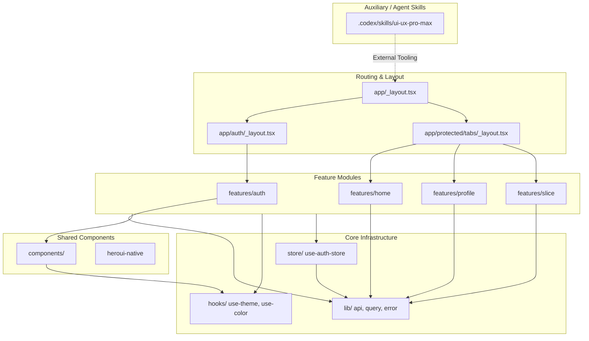

# Architecture Map: equaly-app

The codebase is a modular Expo (React Native) application following a **feature-based architecture**. It separates business logic into domain-specific feature modules, supported by a shared core library and a centralized routing system.

## High-Level Architecture Diagram

## Major Community Summary
| Community | Primary Path | Size | Language | Cohesion | Description |
| :--- | :--- | :--- | :--- | :--- | :--- |
| **Auth Logic** | `features/auth/` | 21+ | TS/TSX | High | Handles registration, login, and password recovery. |
| **Slice Feature** | `features/slice/` | 15+ | TS/TSX | Medium | Core business logic for "slicing" and currency input. |
| **Home/Dashboard**| `features/home/` | 10+ | TSX | Medium | Net balance cards and activity feeds. |
| **Profile/Settings**| `features/profile/`| 10+ | TSX | Medium | Theme selection and account management. |
| **Core Lib** | `lib/` | 10+ | TS | High | OpenAPI fetch client, Zod schemas, and API error handling. |
| **Shared UI** | `components/` | 15+ | TSX | Low | Reusable UI atoms and the custom bottom tab bar. |
| **Agent Skills** | `.codex/skills/` | 30+ | Python | Low | Design system generators and search utilities. |

## Critical Execution Flows
| Flow | Entry Point | Depth | Impact |
| :--- | :--- | :--- | :--- |
| `generate_design_system` | `design_system.py` | 5 | High (Tooling) |
| `AuthTextField` | `auth-text-field.tsx` | 1 | Medium (UI) |
| `RootLayout` | `_layout.tsx` | 1 | High (Boot) |
| `register/login` | `auth.api.ts` | 1 | High (Auth) |
| `CustomBottomTabBar` | `custom-bottom-tab-bar.tsx` | 2 | Medium (Nav) |
| `PrecisionNumpad` | `precision-numpad.tsx` | 3 | Medium (UI) |
| `ProtectedLayout` | `_layout.tsx` | 1 | High (Security)|
| `ThemedText/View` | `themed-text.tsx` | 2 | Medium (UI) |
| `search_stack` | `core.py` | 3 | Medium (Tooling)|
| `TabLayout` | `_layout.tsx` | 1 | High (Nav) |

## Architecture Analysis & Recommendations

### Coupling Warnings
- **High Dispersion**: The graph shows many small, file-based communities. While this is typical for React components, it indicates a lack of strong logical grouping within some feature folders.
- **Auxiliary Leakage**: Python scripts in `.codex` have high criticality in the graph but are decoupled from the runtime app. Ensure these remain as build-time/agent-time tools.

### Recommendations
1. **Consolidate Components**: Move highly coupled components (e.g., `PrecisionNumpad` and `AmountBillboard`) into a dedicated `features/slice/components` sub-module to improve cohesion.
2. **Formalize API Contracts**: Since the project relies on `api.json`, ensure a strict CI check is in place to run `npm run api:types` whenever the spec changes.
3. **Abstract Theme Logic**: The theme logic is spread across `hooks/` and `features/profile`. Centralizing this into a `features/theme` module would reduce cross-boundary dependencies.
